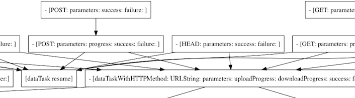
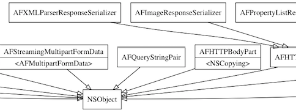
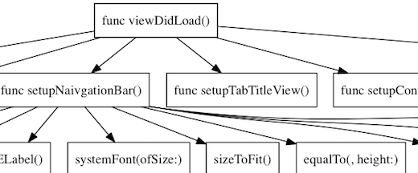
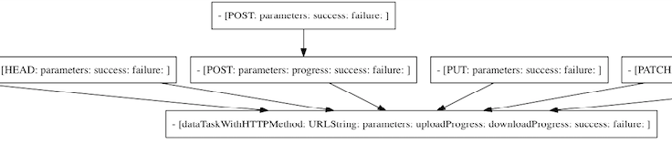

# Drafter
[English Version](#english-version)

## Drafter是什么

- Drafter是一个命令行工具，用于分析iOS工程的代码，支持Objective-C和Swift。
- 自动解析代码并生成方法调用关系图。
- 自动解析代码并生成类继承关系图。

## 安装

执行以下指令，会自动安装到 /usr/local/bin 目录中：

```shell
curl "https://raw.githubusercontent.com/L-Zephyr/Drafter/master/install.sh" | /bin/sh
```
或者直接下载并编译源码

## 基本使用

- 首先确保电脑中安装了[Graphviz](http://www.graphviz.org/Download_macos.php)，可以直接通过Homebrew来安装:`brew install graphviz`

- 生成方法调用关系图，以AFNetworking为例，如：

  ```shell
  drafter -f ./AFHTTPSessionManager.m
  ```

  在当前位置会自动生成一张以"文件名+.png"格式来命名的图片：

  

- 生成类继承关系图：

  ```shell
  drafter -f ./AFNetworking -m inherit
  ```
  在当前位置的文件夹中会生成一张名为"Inheritance.png"的图片，类图的表示遵循UML规则，虚线表示遵循协议，实线表示继承父类：

  

## 参数

- **-f、—file \<arg>**   
  必要参数，指定一个文件或文件夹，多个参数之间用逗号分隔，切勿出现空格。

- **-m、—mode \<arg>**  
  可选参数，指定解析模式，参数值可以为invoke、inherit、both。invoke表示只解析方法调用关系、inherit表示只解析类继承关系、both表示同时执行两种解析模式。默认为invoke。

- **-s、—search \<arg>**  
  可选参数，指定关键字，多个关键字之间用逗号分隔，关键字忽略大小写。根据关键字过滤解析结果，只保留包含指定关键字的节点分支，如:

  ```shell
  drafter -f ./XXViewController.swift -s viewdidload
  ```

  生成的结果中只包含"viewDidLoad"这个方法下的调用信息：

  

- **-self、—self-method-only**  
  可选参数，仅在解析调用关系图时起效，生成结果仅保留用户自定义的方法。
  默认情况下解析调用关系时会将所有的方法调用都解析出来，文件较大时结果会比较杂乱，开启该选项仅保留本文件中定义的方法，让结果更加清晰：

  ```shell
  drafter -f ./AFHTTPSessionManager.m -self
  ```

  可以看到，与上面的第一个例子对比，去掉了调用外部方法的连线，整个代码执行的逻辑更加清晰：

  

## 实现原理

实现细节请看[http://www.jianshu.com/p/9a1a32ec0af6](http://www.jianshu.com/p/9a1a32ec0af6)


## english-version

## What is Drafter

- Drafter is a command-line tool for analyzing iOS code, supporting Objective-C and Swift.
- Automatically generates [call graph](https://en.wikipedia.org/wiki/Call_graph).
- Automatically generates Inheritance graph.

## Install

Run the following command, drafter will automatically install into the `/usr/local/bin` directory.

```shell
curl "https://raw.githubusercontent.com/L-Zephyr/Drafter/master/install.sh" | /bin/sh
```
Or you can download and compile the source directly.

## Basic Use

- First make sure [Graphviz](http://www.graphviz.org/Download_macos.php) was correctly installed. You can install Graphviz by brew: `brew install graphviz`.

- Generate the method call graph, for example:

  ```shell
  drafter -f ./AFHTTPSessionManager.m
  ```

  A picture will automatically generate in the current path, name as "file name + .png": 

  

- Generate the inheritance graph

  ```shell
  drafter -f ./AFNetworking -m inherit
  ```
  A picture named "Inheritance.png" will be generated in the current path:

  

## Parameter

- **-f、—file \<arg>**   
  Required. Specify a file or folder, multiple parameters are separated by commas, don't use space.

- **-m、—mode \<arg>**  
  Optional. Specify the parsing mode. Assigning `invoke` will generate call graph, assigning `inherit` will generate inheritance graph, or `both` to do both call and inheritance analysis. Defaults to `invoke`

- **-s、—search \<arg>**  
  Optional. Specify  keywords to filter the results. Multiple arguments are separated by commas. 
  For example:

  ```shell
  drafter -f ./XXViewController.swift -s viewdidload
  ```

  The generated graph will only contains the  `viewDidLoad` branch.

  

- **-self、—self-method-only**  
  Optional. Only takes effect when parsing the call graph, the generated graph will only contains the methods that user defined in the same file. 

  By default, all the method calls will be parsed. The result will get cluttered when dealing with the large file. Turn on this option, only the methods defined in this file are saved. This will help you highlight the main logic in you code.

  For example:

  ```shell
  drafter -f ./AFHTTPSessionManager.m -self
  ```

  As you can see, in contrast to the first example above, the connection to the external method is removed:

  

