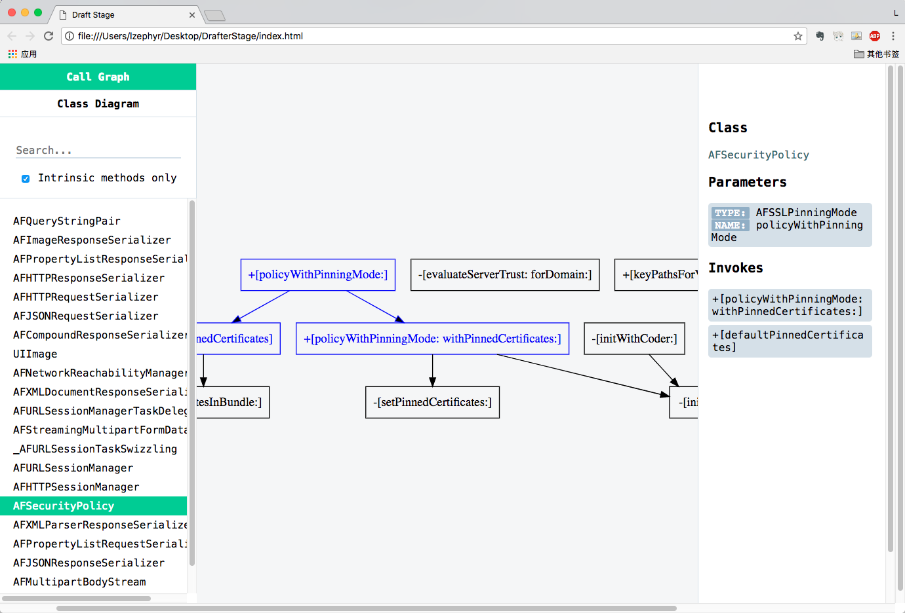

# Drafter
[English Version](#english-version)

## Drafter是什么

- Drafter是一个命令行工具，用于分析iOS工程的代码，支持Objective-C和Swift。
- 自动解析代码并生成方法调用关系图。
- 自动解析代码并生成类继承关系图。

## 安装

执行以下指令，会自动安装到 /usr/local/bin 目录中：

```shell
curl "https://raw.githubusercontent.com/L-Zephyr/Drafter/master/install.sh" | /bin/sh
```
或者直接下载并编译源码

## 基本使用

可以将解析结果导出为HTML或PNG格式，默认为HTML

### 导出为HTML

以AFNetworking的源码为例，在命令行中执行如下命令，在参数`-f`后输入文件或目录：

```shell
drafter -f ./AFNetworking
```

解析结果会输出到当前路径下的`DrafterStage`文件夹中，用浏览器打开`./DrafterStage/index.html`文件即可浏览，请使用**chrome**浏览器打开：



在浏览器中可以交互式的浏览各个类型中的方法调用，以及整体的类图关系，强烈建议通过这种方式来使用Drafter。前端部分的代码开源在[DrafterStage](https://github.com/L-Zephyr/DrafterStage)，本人并非前端开发，所以代码还有许多不完善的地方，仅在chrome环境中经过测试。

### 导出为PNG

- 如果要导出为PNG图片，首先确保电脑中安装了[Graphviz](http://www.graphviz.org/Download_macos.php)，可以直接通过Homebrew来安装:`brew install graphviz`

- 生成方法调用关系图，以AFNetworking为例，在命令后面使用`-t`参数指定输出类型为`png`，如：

  ```shell
  drafter -f ./AFHTTPSessionManager.m -t png
  ```

  在当前位置会自动生成一张以"文件名+.png"格式来命名的图片：

  

- 生成类继承关系图，使用`-m`参数将解析模式设定为`inherit`，解析继承结构：

  ```shell
  drafter -f ./AFNetworking -t png -m inherit
  ```
  在当前位置的文件夹中会生成一张名为"Inheritance.png"的图片，类图的表示遵循UML规则，虚线表示遵循协议，实线表示继承父类：

  

## 参数

- **-f、—file \<arg>**   
  必要参数，指定一个文件或文件夹，多个参数之间用逗号分隔，切勿出现空格。

- **-t、--type**  

  可选参数，指定结果的输出形式，参数值为html或png，默认为html。

- **-m、—mode \<arg>**  
  可选参数，仅在PNG模式中有效，指定解析模式，参数值可以为invoke、inherit、both。invoke表示只解析方法调用关系、inherit表示只解析类继承关系、both表示同时执行两种解析模式。默认为invoke。

- **-s、—search \<arg>**  
  可选参数，仅在PNG模式中有效，指定关键字，多个关键字之间用逗号分隔，关键字忽略大小写。根据关键字过滤解析结果，只保留包含指定关键字的节点分支，如:

  ```shell
  drafter -f ./XXViewController.swift -s viewdidload -t png
  ```

  生成的结果中只包含"viewDidLoad"这个方法下的调用信息：

  

- **-self、—self-method-only**  
  可选参数，仅在PNG模式中解析调用关系图时有效，生成结果仅保留用户自定义的方法。
  默认情况下解析调用关系时会将所有的方法调用都解析出来，文件较大时结果会比较杂乱，开启该选项仅保留本文件中定义的方法，让结果更加清晰：

  ```shell
  drafter -f ./AFHTTPSessionManager.m -self -t png
  ```

  可以看到，与上面的第一个例子对比，去掉了调用外部方法的连线，整个代码执行的逻辑更加清晰：

  

## 实现原理

实现细节请看[https://juejin.im/post/5a3088e95188253ee45b6cbe](https://juejin.im/post/5a3088e95188253ee45b6cbe)


## english-version

## What is Drafter

- Drafter is a command-line tool for analyzing iOS code, supporting Objective-C and Swift.
- Automatically generates [call graph](https://en.wikipedia.org/wiki/Call_graph).
- Automatically generates Inheritance graph.

## Install

Run the following command, drafter will automatically install into the `/usr/local/bin` directory.

```shell
curl "https://raw.githubusercontent.com/L-Zephyr/Drafter/master/install.sh" | /bin/sh
```
Or you can download and compile the source directly.

## Basic Use

### Export to HTML

Run the following command. Enter the file or directory path after the `-f` argument :

```shell
drafter -f ./AFNetworking
```

Analysis result will be generated to the path `./DrafterStage`. Then just open the file `./DrafterStage/index.html` in browser (Recommended **Chrome**) :


In the browser you can interactively browse the Call Graph and the Class Dragram, it is strongly recommended to use drafter in this way.

### Export to PNG

- If you would like to get png from the analysis result. First make sure [Graphviz](http://www.graphviz.org/Download_macos.php) was correctly installed. You can install Graphviz by brew: `brew install graphviz`.

- Generate the method call graph. Use argument `-t png` to specify the png mode, for example:

  ```shell
  drafter -f ./AFHTTPSessionManager.m -t png
  ```

  A picture will automatically generate in the current path, name as "file name + .png": 

  

- Generate the inheritance graph

  ```shell
  drafter -f ./AFNetworking -m inherit -t png
  ```
  A picture named "Inheritance.png" will be generated in the current path:

  

## Parameter

- **-f , —file \<arg>**   
  Required. Specify a file or folder, multiple parameters are separated by commas, don't use space.

- **-t , —type \<arg>**  

  Optional. Specify the output type, `html` or `png`. Defaults to `html`.

- **-m , —mode \<arg>**  
  Optional. Specify the parsing mode, only valid in `png` mode. Assigning `invoke` will generate call graph, assigning `inherit` will generate inheritance graph, or `both` to do both call and inheritance analysis. Defaults to `invoke`

- **-s , —search \<arg>**  
  Optional. Specify  keywords to filter the results, only valid in `png` mode. Multiple arguments are separated by commas. 
  For example:

  ```shell
  drafter -f ./XXViewController.swift -s viewdidload -t png
  ```

  The generated graph will only contains the  `viewDidLoad` branch.

  

- **-self , —self-method-only**  
  Optional. Only takes effect when parsing the call graph in `png` mode, the generated graph will only contains the methods that user defined in the same file. 

  By default, all the method calls will be parsed. The result will get cluttered when dealing with the large file. Turn on this option, only the methods defined in this file are saved. This will help you highlight the main logic in you code.

  For example:

  ```shell
  drafter -f ./AFHTTPSessionManager.m -self -t png
  ```

  As you can see, in contrast to the first example above, the connection to the external method is removed:

  

